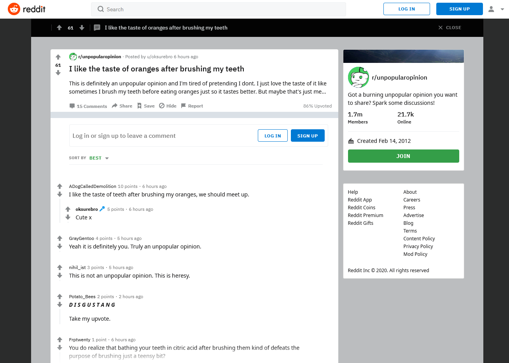
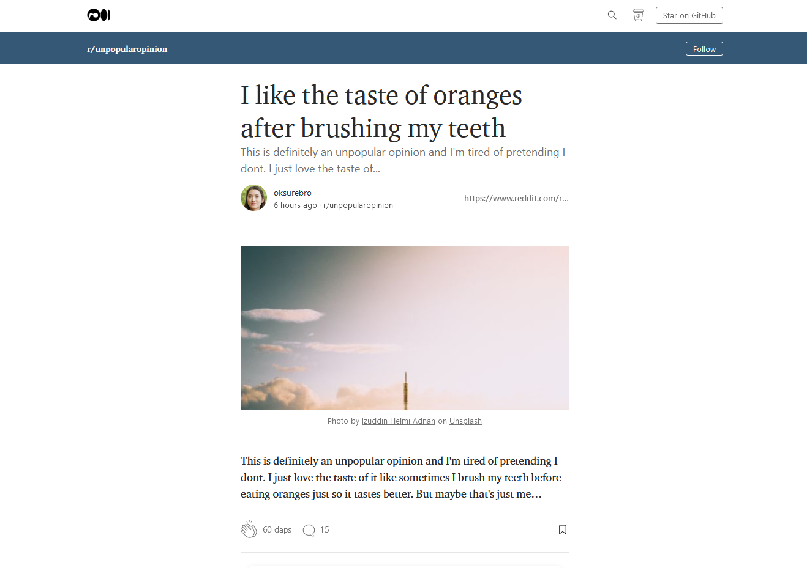

<h3 align="center"></h3>

<p align="center">
  <a href="https://reddium.vercel.app" target="_blank" rel="noopener noreferrer"></a>
  <a href="https://github.com/eightants/reddium/releases/latest"></a>
  <a href="https://ko-fi.com/eightants" target="_blank" rel="noopener noreferrer"></a>
</p>

Have you ever wanted to browse Reddit while studying at Starbucks? Or maybe while sitting on the subway to work? In those situations, you might start being self-conscious of Reddit's bright and distinct website. What if people around you judge the subreddits you browse and the posts you read? Now, think about someone browsing Medium in the same situations. Just seeing the interface of Medium gives the impression of someone being a "knowledge seeker".

On the other hand, the Reddit experience on a mobile browser is lacking at best. Many functionalities require you to download the Reddit app. Is there a way to improve the experience without downloading the app?

Enter Reddium: [reddium.vercel.app](https://reddium.vercel.app)

Reddium is a Medium-themed Reddit client. No longer worry about being judged while browsing Reddit in public. The Reddium interface converts Reddit posts, discussions, and memes into well-crafted articles. Once remote work is over, Reddium will be the perfect site to visit during your commute.

Built with Next.js, TailwindCSS, and hosted on Vercel. Reddium is built with optimization in mind, making use of Next.js 10's analytics and server-side rendering. Placeholder images are obtained from [Unsplash](https://unsplash.com), and avatars are generated from [thispersondoesnotexist.com](https://thispersondoesnotexist.com/). Reddium is currently still in development.



Distinct Reddit interface



On Reddium


## Functionality

- Browse subreddits, posts, and comments in the Medium interface
- Search Reddit through the Medium search interface
- Visit user profiles
- Quality of life features to recreate the Reddit experience as closely as possible (WIP)
- Login with Reddit to view your personal subscriptions in Reddium (Planned)

## Contribute

1. Clone the repository to your local machine. 
2. Install all packages. 
```
$ npm i
```
3. Start the development server. 
```
$ npm run dev
```
4. Make a pull request
